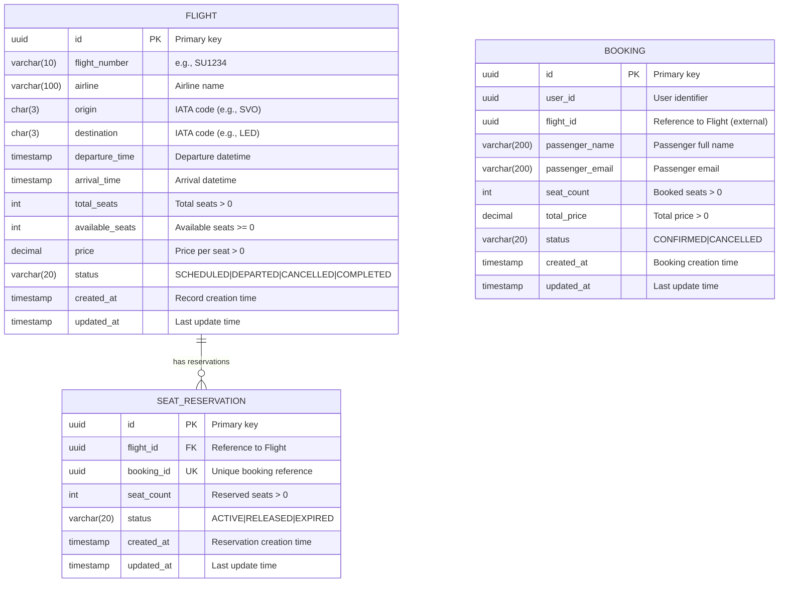

# ER-диаграмма системы бронирования авиабилетов

## Диаграмма в формате Mermaid (3NF)

## Описание сущностей

### Flight Service Database

#### Таблица `flights`

| Поле | Тип | Ограничения | Описание |
|------|-----|-------------|----------|
| id | UUID | PRIMARY KEY | Уникальный идентификатор рейса |
| flight_number | VARCHAR(10) | NOT NULL | Номер рейса (e.g., SU1234) |
| airline | VARCHAR(100) | NOT NULL | Название авиакомпании |
| origin | CHAR(3) | NOT NULL | IATA-код аэропорта вылета |
| destination | CHAR(3) | NOT NULL | IATA-код аэропорта прилёта |
| departure_time | TIMESTAMP | NOT NULL | Время вылета |
| arrival_time | TIMESTAMP | NOT NULL | Время прилёта |
| total_seats | INTEGER | NOT NULL, CHECK > 0 | Общее количество мест |
| available_seats | INTEGER | NOT NULL, CHECK >= 0 | Доступные места |
| price | DECIMAL(10,2) | NOT NULL, CHECK > 0 | Цена за место |
| status | VARCHAR(20) | NOT NULL, DEFAULT 'SCHEDULED' | Статус рейса |
| created_at | TIMESTAMP | NOT NULL, DEFAULT NOW() | Время создания |
| updated_at | TIMESTAMP | NOT NULL, DEFAULT NOW() | Время обновления |

**Ограничения:**
- `UNIQUE (flight_number, DATE(departure_time))` - уникальность рейса на дату
- `CHECK (available_seats <= total_seats)` - доступных мест не больше общего
- `CHECK (arrival_time > departure_time)` - время прилёта после вылета

#### Таблица `seat_reservations`

| Поле | Тип | Ограничения | Описание |
|------|-----|-------------|----------|
| id | UUID | PRIMARY KEY | Уникальный идентификатор резервации |
| flight_id | UUID | NOT NULL, FOREIGN KEY | Ссылка на рейс |
| booking_id | UUID | NOT NULL, UNIQUE | Ссылка на бронирование (внешняя) |
| seat_count | INTEGER | NOT NULL, CHECK > 0 | Количество зарезервированных мест |
| status | VARCHAR(20) | NOT NULL, DEFAULT 'ACTIVE' | Статус резервации |
| created_at | TIMESTAMP | NOT NULL, DEFAULT NOW() | Время создания |
| updated_at | TIMESTAMP | NOT NULL, DEFAULT NOW() | Время обновления |

**Ограничения:**
- `FOREIGN KEY (flight_id) REFERENCES flights(id)` - связь с рейсом
- `UNIQUE (booking_id)` - одна резервация на бронирование

### Booking Service Database

#### Таблица `bookings`

| Поле | Тип | Ограничения | Описание |
|------|-----|-------------|----------|
| id | UUID | PRIMARY KEY | Уникальный идентификатор бронирования |
| user_id | UUID | NOT NULL | Идентификатор пользователя |
| flight_id | UUID | NOT NULL | Ссылка на рейс (внешний сервис) |
| passenger_name | VARCHAR(200) | NOT NULL | ФИО пассажира |
| passenger_email | VARCHAR(200) | NOT NULL | Email пассажира |
| seat_count | INTEGER | NOT NULL, CHECK > 0 | Количество мест |
| total_price | DECIMAL(10,2) | NOT NULL, CHECK > 0 | Общая стоимость |
| status | VARCHAR(20) | NOT NULL, DEFAULT 'CONFIRMED' | Статус бронирования |
| created_at | TIMESTAMP | NOT NULL, DEFAULT NOW() | Время создания |
| updated_at | TIMESTAMP | NOT NULL, DEFAULT NOW() | Время обновления |

**Индексы:**
- `INDEX ON (user_id)` - для поиска бронирований пользователя
- `INDEX ON (flight_id)` - для поиска бронирований на рейс

## Обоснование 3NF

1. **1NF (Первая нормальная форма):**
   - Все атрибуты атомарны (нет составных или многозначных атрибутов)
   - Каждая таблица имеет первичный ключ

2. **2NF (Вторая нормальная форма):**
   - Выполнена 1NF
   - Все неключевые атрибуты полностью зависят от первичного ключа
   - Нет частичных зависимостей (все PK - одиночные UUID)

3. **3NF (Третья нормальная форма):**
   - Выполнена 2NF
   - Нет транзитивных зависимостей
   - Все неключевые атрибуты зависят только от первичного ключа

## Ограничения целостности данных

1. **Количество мест:**
   - `total_seats > 0` - общее количество строго положительное
   - `available_seats >= 0` - доступные места не отрицательные
   - `available_seats <= total_seats` - доступных не больше общего

2. **Цены:**
   - `price > 0` - цена билета строго положительная
   - `total_price > 0` - общая стоимость строго положительная

3. **Временные ограничения:**
   - `arrival_time > departure_time` - прилёт после вылета

4. **Уникальность:**
   - Комбинация `(flight_number, DATE(departure_time))` уникальна
   - `booking_id` в резервациях уникален (одна резервация на бронирование)
