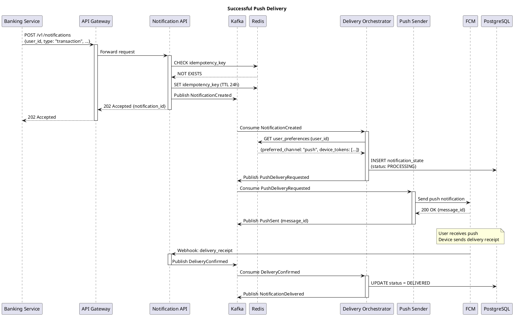
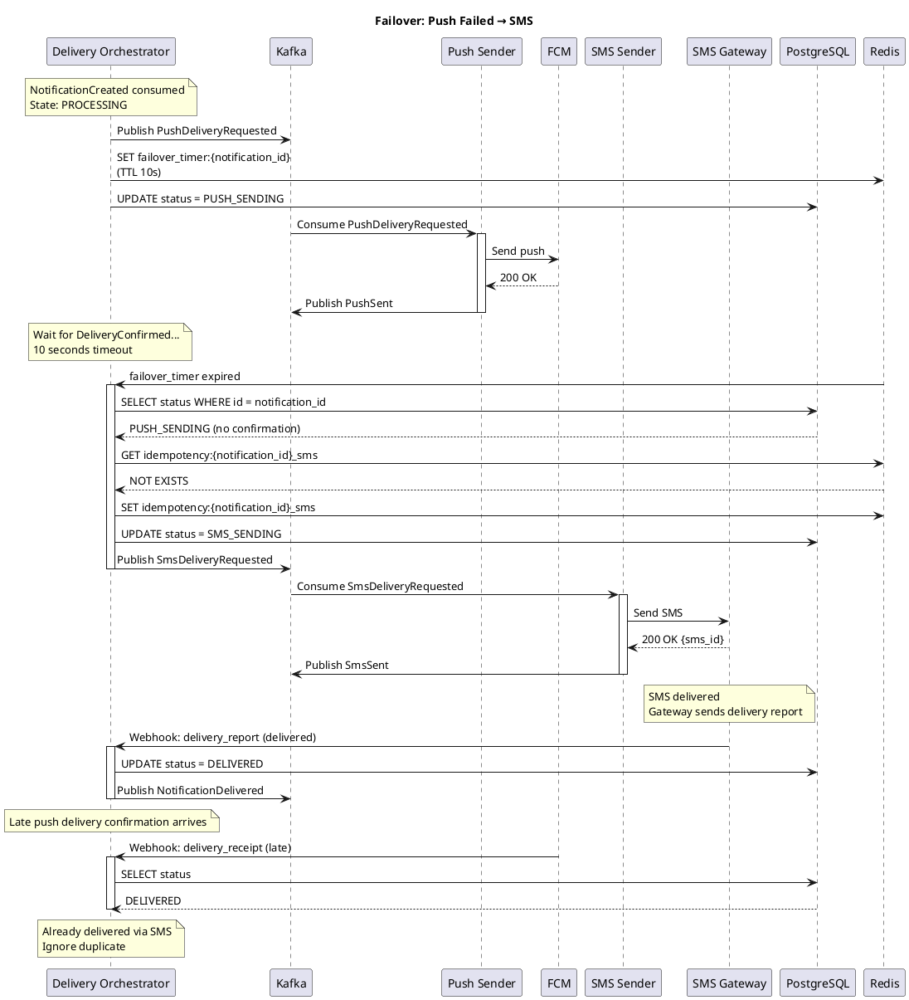
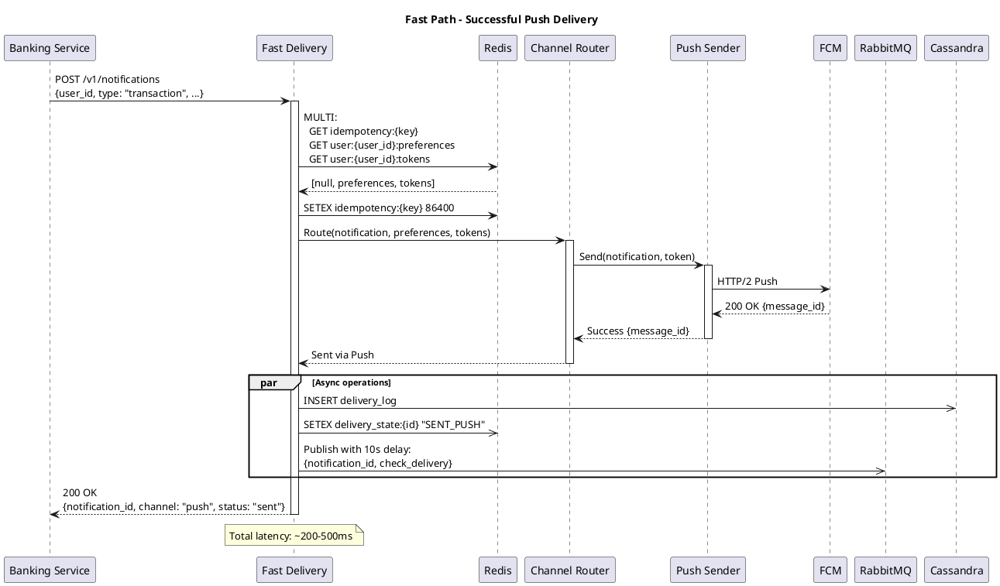
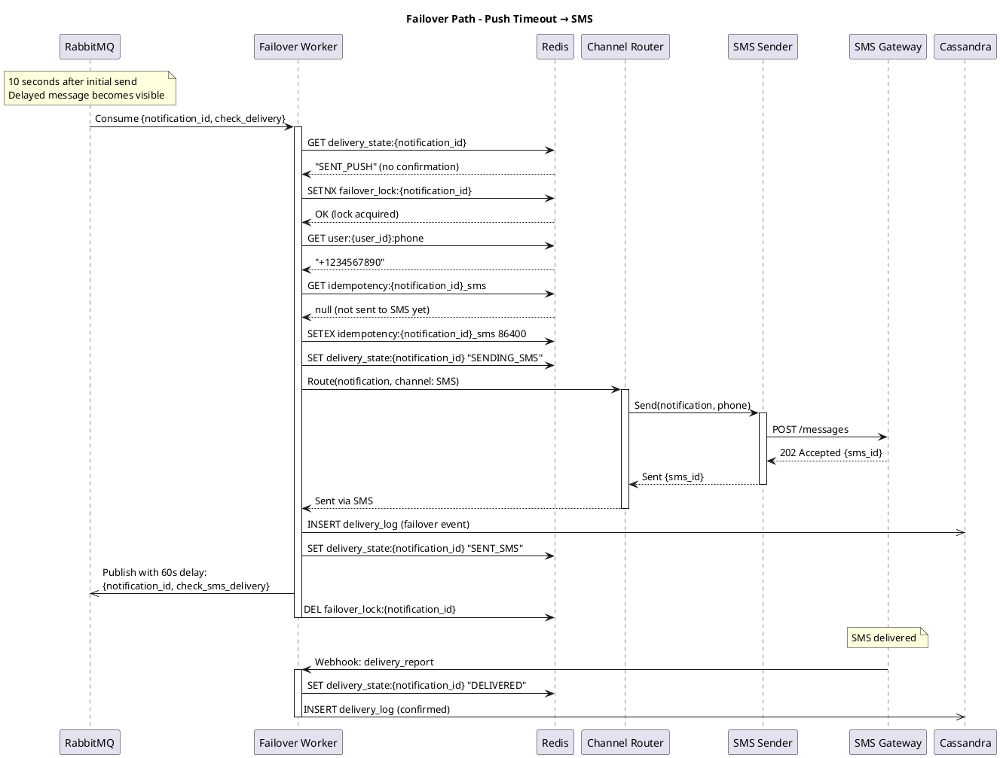

# Домашнее задание №4: Notification Platform

## Содержание
1. [Функциональные требования](#1-функциональные-требования)
2. [Нефункциональные требования](#2-нефункциональные-требования)
3. [Архитектурно значимые требования (ASR)](#3-архитектурно-значимые-требования-asr)
4. [Ключевые архитектурные вопросы](#4-ключевые-архитектурные-вопросы)
5. [Архитектурные последствия ASR](#5-архитектурные-последствия-asr)
6. [Архитектурные решения, которые НЕ подходят](#6-архитектурные-решения-которые-не-подходят)
7. [Неопределённости и архитектурные риски](#7-неопределённости-и-архитектурные-риски)
8. [RFC: Гарантированная доставка критичных уведомлений](#8-rfc-гарантированная-доставка-критичных-уведомлений)

---

## 1. Функциональные требования

### FR-1: Отправка транзакционных уведомлений
**User Story:** Как пользователь банка, я хочу мгновенно получать уведомление о списании/зачислении средств, чтобы контролировать свои финансы и быстро реагировать на подозрительные операции.

**Критерии приёмки:**
- Уведомление отправляется в течение 3 секунд после совершения транзакции
- Уведомление содержит: сумму, получателя/отправителя, остаток на счёте
- Транзакционные уведомления нельзя отключить (требование безопасности)

### FR-2: Отправка сервисных уведомлений
**User Story:** Как пользователь, я хочу получать напоминания о платежах и статусах заявок, чтобы не пропустить важные события.

**Критерии приёмки:**
- Система отправляет напоминания о предстоящих платежах за 3 дня и за 1 день
- Пользователь получает уведомление об изменении статуса заявки (кредит, карта)
- Пользователь может настроить время получения напоминаний

### FR-3: Отправка маркетинговых уведомлений
**User Story:** Как маркетолог, я хочу отправлять персонализированные предложения пользователям, чтобы увеличить продажи банковских продуктов.

**Критерии приёмки:**
- Возможность сегментации аудитории по критериям
- Возможность отложенной отправки (scheduled)
- Поддержка A/B тестирования
- Отслеживание метрик: доставлено, открыто, клики

### FR-4: Управление предпочтениями пользователя
**User Story:** Как пользователь, я хочу управлять настройками уведомлений, чтобы получать только нужную мне информацию удобным способом.

**Критерии приёмки:**
- Выбор предпочтительного канала доставки (push/SMS/email)
- Возможность отключить маркетинговые уведомления
- Возможность отключить часть сервисных уведомлений
- Настройка "тихих часов" (do not disturb)
- Транзакционные уведомления отключить нельзя

### FR-5: Кросс-канальный failover
**User Story:** Как пользователь, я хочу гарантированно получить критичное уведомление, даже если один из каналов доставки недоступен.

**Критерии приёмки:**
- При недоставке через основной канал система автоматически использует резервный
- Порядок failover: push → SMS → email
- Уведомление не дублируется при переключении каналов

### FR-6: Массовые рассылки
**User Story:** Как маркетолог, я хочу отправлять массовые кампании на миллионы пользователей, чтобы информировать их об акциях и новых продуктах.

**Критерии приёмки:**
- Поддержка рассылок до 1 млн получателей
- Rate limiting для защиты внешних провайдеров
- Возможность приостановить/отменить кампанию
- Прогресс-бар и статистика по кампании в реальном времени

### FR-7: Дедупликация уведомлений
**User Story:** Как пользователь, я не хочу получать дублирующиеся уведомления, чтобы не раздражаться и не терять доверие к банку.

**Критерии приёмки:**
- Система предотвращает повторную отправку одного и того же уведомления
- Окно дедупликации: 24 часа для маркетинговых, 1 час для сервисных

---

## 2. Нефункциональные требования

### NFR-1: Производительность (Performance)
| Метрика | Значение |
|---------|----------|
| Latency транзакционных уведомлений (p99) | ≤ 3 секунды от события до отправки провайдеру |
| Latency сервисных уведомлений (p99) | ≤ 30 секунд |
| Latency маркетинговых уведомлений (p99) | ≤ 5 минут |
| Throughput | 100 000 уведомлений/секунду (пиковая нагрузка) |

### NFR-2: Надёжность (Reliability)
| Метрика | Значение |
|---------|----------|
| Availability | 99.95% (не более 22 минут простоя в месяц) |
| Durability уведомлений | 99.999% (уведомление не должно быть потеряно) |
| Success Rate доставки критичных | ≥ 99.9% |
| Recovery Time Objective (RTO) | ≤ 5 минут |
| Recovery Point Objective (RPO) | 0 (no data loss) |

### NFR-3: Масштабируемость (Scalability)
| Метрика | Значение |
|---------|----------|
| MAU | 10 млн пользователей |
| DAU | 3 млн пользователей |
| Peak Concurrent Users | 300 000 |
| Уведомлений в день | ~30 млн (10 × 3 млн DAU) |
| Горизонтальное масштабирование | Линейное при добавлении нод |

### NFR-4: Observability (Наблюдаемость)
| Метрика | Значение |
|---------|----------|
| Трассировка | 100% для транзакционных, 10% sampling для остальных |
| Время обнаружения проблем | ≤ 1 минута |
| Dashboards | Real-time метрики по каналам, типам, статусам |
| Alerting | Автоматические алерты при деградации SLA |

### NFR-5: Безопасность (Security)
| Требование | Описание |
|------------|----------|
| Шифрование | TLS 1.3 для передачи, AES-256 для хранения PII |
| Аутентификация | mTLS между сервисами, API keys для внешних систем |
| Audit log | Все действия с уведомлениями логируются |
| PCI DSS | Маскирование номеров карт в уведомлениях |

### NFR-6: Стоимость (Cost Efficiency)
| Требование | Описание |
|------------|----------|
| Приоритет каналов по стоимости | Push (бесплатно) → Email (~$0.001) → SMS (~$0.03) |
| Оптимизация | Использовать дешёвый канал, если нет требований к срочности |
| Batching | Группировка маркетинговых уведомлений для снижения costs |

---

## 3. Архитектурно значимые требования (ASR)

### ASR-1: Низкая задержка транзакционных уведомлений

**Связанные требования:**
- FR-1: Отправка транзакционных уведомлений (≤ 3 секунды)
- NFR-1: Performance (p99 latency ≤ 3 секунды)
- NFR-2: Reliability (Success Rate ≥ 99.9%)

**Почему влияет на архитектуру:**

Требование мгновенной доставки критичных уведомлений определяет:
- **Синхронный путь** для транзакционных уведомлений с минимальным количеством хопов
- **Приоритетные очереди** — транзакционные уведомления не должны ждать в очереди за маркетинговыми
- **In-memory кэширование** пользовательских настроек для исключения обращений к БД
- **Выделенный пул соединений** с провайдерами для критичных уведомлений
- **Географическое размещение** — близость к пользователям и провайдерам

**Приоритет:** Критический

---

### ASR-2: Гарантированная доставка с кросс-канальным failover

**Связанные требования:**
- FR-5: Кросс-канальный failover
- FR-7: Дедупликация уведомлений
- NFR-2: Durability 99.999%, Success Rate ≥ 99.9%

**Почему влияет на архитектуру:**

Необходимость гарантировать доставку через альтернативный канал требует:
- **Персистентная очередь сообщений** — уведомление не теряется при сбое
- **State machine** для отслеживания статуса доставки по каждому каналу
- **Idempotency keys** для предотвращения дубликатов
- **Timeout и retry механизмы** с экспоненциальным backoff
- **Circuit breaker** для защиты от каскадных сбоев провайдеров
- **Отдельная БД статусов** для быстрого чтения/записи состояния доставки

**Приоритет:** Критический

---

### ASR-3: Высокая пропускная способность для массовых рассылок

**Связанные требования:**
- FR-6: Массовые рассылки до 1 млн получателей
- NFR-3: Scalability (30 млн уведомлений/день, 100K/сек пиковая)

**Почему влияет на архитектуру:**

Массовые кампании создают spike нагрузки и требуют:
- **Горизонтально масштабируемая обработка** — добавление воркеров по требованию
- **Rate limiting** на уровне провайдеров и глобальный
- **Backpressure** механизмы для защиты системы
- **Batch processing** для эффективной отправки
- **Отдельные очереди** для разных типов уведомлений (изоляция blast radius)
- **Partitioning** данных для параллельной обработки

**Приоритет:** Высокий

---

### ASR-4: Наблюдаемость процесса доставки

**Связанные требования:**
- NFR-4: Observability (real-time мониторинг, alerting)
- Бизнес-цель: Снизить жалобы на 30%

**Почему влияет на архитектуру:**

End-to-end visibility требует:
- **Distributed tracing** — correlation ID через все компоненты
- **Event sourcing** — хранение всех событий жизненного цикла уведомления
- **Real-time streaming** метрик для dashboards
- **Structured logging** с обязательными полями
- **Отдельный сервис аналитики** для агрегации и отчётов

**Приоритет:** Высокий

---

## 4. Ключевые архитектурные вопросы

### AQ-1: Как обеспечить разную скорость обработки для разных типов уведомлений?

**Порождающие требования/ASR:**
- ASR-1: Низкая задержка транзакционных (≤ 3 сек)
- ASR-3: Высокая пропускная способность для массовых рассылок
- NFR-1: Разные SLA для разных типов (3 сек / 30 сек / 5 мин)

**Почему важен:**

Если транзакционные и маркетинговые уведомления идут через один путь, массовая рассылка может заблокировать критичные уведомления. Нужно решить:
- Общая очередь с приоритетами vs отдельные очереди
- Единый сервис отправки vs специализированные по типам
- Как балансировать ресурсы между типами

---

### AQ-2: Как определить, что уведомление доставлено, и когда переключаться на failover?

**Порождающие требования/ASR:**
- ASR-2: Гарантированная доставка с failover
- FR-5: Кросс-канальный failover
- FR-7: Дедупликация

**Почему важен:**

Разные каналы имеют разную семантику "доставки":
- Push: delivery receipt от устройства, но устройство может быть офлайн
- SMS: delivery report от оператора (асинхронный, может прийти через минуты)
- Email: нет надёжного механизма подтверждения доставки

Нужно определить:
- Timeout для каждого канала до failover
- Что считать успешной доставкой для каждого канала
- Как избежать дублей, если delivery report придёт после failover

---

### AQ-3: Как обеспечить exactly-once semantics при failover и retry?

**Порождающие требования/ASR:**
- ASR-2: Гарантированная доставка
- FR-7: Дедупликация
- NFR-2: Durability (no data loss)

**Почему важен:**

At-least-once delivery в распределённой системе легко достижим, но может привести к дубликатам. Exactly-once требует:
- Идемпотентные операции на стороне провайдеров (не всегда возможно)
- Глобальное состояние доставки с ACID гарантиями
- Корректная обработка race conditions при параллельных retry

---

### AQ-4: Как масштабировать хранение состояния доставки?

**Порождающие требования/ASR:**
- ASR-3: 30 млн уведомлений/день
- ASR-4: Наблюдаемость (хранение истории)
- NFR-2: Durability

**Почему важен:**

30 млн записей в день = ~1 млрд в месяц. Нужно решить:
- Какую БД использовать (SQL vs NoSQL)
- Стратегия партиционирования
- Retention policy (сколько хранить)
- Как обеспечить быстрый lookup по notification_id

---

## 5. Архитектурные последствия ASR

### ASR-1: Низкая задержка транзакционных уведомлений

**Архитектурные последствия:**
- **Отдельный fast path** для транзакционных уведомлений в обход общей очереди
- **In-memory cache** (Redis) для пользовательских настроек и токенов устройств
- **Connection pooling** с pre-warmed соединениями к провайдерам
- **Асинхронная персистенция** — сначала отправка, потом запись в лог
- **Выделенные ресурсы** — отдельные поды/инстансы для транзакционных
- **Географическая близость** к провайдерам (multi-region deployment)

---

### ASR-2: Гарантированная доставка с failover

**Архитектурные последствия:**
- **Durable message queue** (Kafka) — уведомление сохраняется до подтверждения
- **State machine** в БД для каждого уведомления: PENDING → SENDING → DELIVERED/FAILED
- **Delivery Status Service** — отдельный компонент для отслеживания статусов
- **Idempotency store** — хранение idempotency keys с TTL
- **Circuit breaker** для каждого провайдера (Resilience4j/Hystrix паттерн)
- **Dead Letter Queue** для failed уведомлений с manual review
- **Distributed locking** (Redis) для предотвращения параллельных retry

---

### ASR-3: Высокая пропускная способность

**Архитектурные последствия:**
- **Горизонтальное масштабирование** — stateless воркеры + auto-scaling
- **Partitioned queues** — партиционирование по user_id для параллелизма
- **Отдельные очереди по типам** — изоляция нагрузки
- **Batch API** к провайдерам где поддерживается
- **Rate limiter** — Token bucket на уровне провайдера
- **Backpressure** — отклонение новых запросов при перегрузке
- **Sharded database** — партиционирование по notification_id

---

### ASR-4: Наблюдаемость

**Архитектурные последствия:**
- **Correlation ID** пробрасывается через все компоненты
- **Event sourcing** — все события записываются в event store
- **Metrics pipeline** — Prometheus + Grafana для real-time dashboards
- **Structured logging** — JSON формат с обязательными полями
- **Distributed tracing** — Jaeger/Zipkin интеграция
- **Alerting rules** — автоматические алерты при нарушении SLA
- **Analytics service** — отдельный компонент для агрегации и отчётов

---

## 6. Архитектурные решения, которые НЕ подходят

### Неподходящее решение 1: Синхронная отправка через REST API

**Описание решения:**
Клиентские сервисы (payments, loans) синхронно вызывают Notification Platform через REST API и ждут ответа о доставке уведомления.

**Какой ASR нарушается:**
- ASR-1: Низкая задержка транзакционных уведомлений
- ASR-2: Гарантированная доставка
- ASR-3: Высокая пропускная способность

**Почему не подходит:**
1. **Latency каскадируется** — если провайдер SMS отвечает 2 секунды, вся транзакция оплаты блокируется на 2+ секунды
2. **Coupling** — сбой Notification Platform блокирует критичные бизнес-процессы
3. **No durability** — при сбое сети между сервисами уведомление теряется
4. **Throttling** — если Notification Platform перегружена, клиентские сервисы получают ошибки
5. **Retry burden** — клиенты должны сами реализовывать retry логику

**Правильный подход:** Асинхронная отправка через message queue. Клиент публикует событие и продолжает работу, не ожидая доставки.

---

### Неподходящее решение 2: Единая очередь для всех типов уведомлений

**Описание решения:**
Все уведомления (транзакционные, сервисные, маркетинговые) помещаются в одну общую очередь и обрабатываются в порядке FIFO.

**Какой ASR нарушается:**
- ASR-1: Низкая задержка транзакционных уведомлений (≤ 3 сек)

**Почему не подходит:**
1. **Head-of-line blocking** — массовая маркетинговая рассылка (1 млн сообщений) может заблокировать очередь на часы
2. **Нет приоритизации** — критичное уведомление о списании ждёт за промо-акцией
3. **Невозможно соблюсти разные SLA** — 3 сек для транзакционных vs 5 мин для маркетинговых
4. **Blast radius** — проблема с маркетинговыми влияет на транзакционные

**Правильный подход:** Отдельные очереди для каждого типа уведомлений с разными приоритетами и выделенными ресурсами.

---

### Неподходящее решение 3: Polling для проверки статуса доставки

**Описание решения:**
Сервис доставки отправляет уведомление провайдеру и затем периодически опрашивает API провайдера для получения статуса доставки.

**Какой ASR нарушается:**
- ASR-1: Низкая задержка
- ASR-3: Высокая пропускная способность
- NFR-6: Cost efficiency

**Почему не подходит:**
1. **Высокая нагрузка** — 30 млн уведомлений × N polls = сотни миллионов запросов
2. **Задержка в обнаружении** — если polling interval 30 сек, failover запускается с задержкой
3. **Rate limits провайдеров** — частый polling может превысить лимиты API
4. **Wasted resources** — большинство polls возвращают "still pending"

**Правильный подход:** Webhooks/callbacks от провайдеров для получения статуса доставки.

---

## 7. Неопределённости и архитектурные риски

### Неопределённость 1: Надёжность delivery reports от провайдеров

**Что неизвестно:**
- Гарантируют ли провайдеры SMS доставку delivery reports?
- Какой процент push-уведомлений не получает delivery confirmation из-за offline устройств?
- Какова типичная задержка delivery report для каждого провайдера?

**Влияние на архитектуру:**
Если delivery reports ненадёжны, мы не можем точно определить момент failover, что может привести к:
- Преждевременному failover → дубликаты уведомлений
- Запоздалому failover → нарушение SLA

**Как проверить:**
1. **Провести PoC** с каждым провайдером на тестовых аккаунтах
2. **Измерить метрики** в production на небольшом трафике:
   - % сообщений с delivery report
   - Время от отправки до delivery report (p50, p95, p99)
   - % ложных статусов (reported delivered, но не дошло)
3. **Уточнить SLA** с провайдерами в контракте

---

### Неопределённость 2: Поведение системы при массовом сбое провайдера

**Что неизвестно:**
- Какова корреляция сбоев между провайдерами? (Если FCM падает, падает ли APNS?)
- Сколько уведомлений накопится в очереди за время сбоя?
- Какой будет spike нагрузки после восстановления?

**Влияние на архитектуру:**
При сбое основного провайдера на 30 минут:
- 30 мин × 350 уведомлений/сек = 630 000 уведомлений в failover очереди
- Резервный провайдер (SMS) может не выдержать нагрузку
- Стоимость SMS failover: 630 000 × $0.03 = $18 900 за один инцидент

**Как проверить:**
1. **Chaos engineering** — имитация сбоя провайдера в staging
2. **Load testing** — тест failover при полной нагрузке
3. **Capacity planning** — расчёт размера очереди и throughput резервных каналов
4. **Cost modeling** — расчёт бюджета на SMS failover

---

### Неопределённость 3: Паттерны использования и пиковые нагрузки

**Что неизвестно:**
- Каково реальное распределение нагрузки по времени суток?
- Какой множитель пиковой нагрузки относительно средней?
- Как коррелируют маркетинговые кампании с транзакционной активностью?

**Влияние на архитектуру:**
Неправильная оценка пиков может привести к:
- Under-provisioning → нарушение SLA в пиковые часы
- Over-provisioning → лишние затраты на инфраструктуру

**Как проверить:**
1. **Анализ исторических данных** — если есть legacy система, проанализировать паттерны
2. **Gradual rollout** — начать с 10% трафика и собрать метрики
3. **Synthetic load testing** — имитация пиковых сценариев
4. **Auto-scaling policies** — настройка на основе реальных метрик

---

### Риск 1: Vendor lock-in на провайдеров

**Описание риска:**
Глубокая интеграция с конкретным SMS/push провайдером может затруднить миграцию при:
- Изменении ценовой политики провайдера
- Деградации качества сервиса
- Регуляторных требованиях (локализация данных)

**Митигация:**
- Абстрактный интерфейс провайдера (Provider Adapter pattern)
- Конфигурируемый routing между провайдерами
- Регулярное тестирование резервных провайдеров

---

## 8. RFC: Гарантированная доставка критичных уведомлений

# RFC: Проектирование механизма гарантированной доставки критичных уведомлений с автоматическим failover между каналами

## Metadata

| Поле | Значение |
|------|----------|
| RFC ID | RFC-2024-001 |
| Название | Guaranteed Delivery with Cross-Channel Failover |
| Автор | Notification Platform Team |
| Статус | Draft |
| Дата | 2024 |

## 1. Введение

### 1.1 Проблема

Транзакционные уведомления (подтверждение перевода, списание средств, OTP-коды) являются критичными для бизнеса и безопасности пользователей. Текущие проблемы:

1. **Недоставка уведомлений** — пользователь не узнаёт о списании, что ведёт к жалобам и fraud detection issues
2. **Нестабильность провайдеров** — FCM, APNS, SMS-шлюзы периодически недоступны
3. **Дублирование** — retry механизмы без идемпотентности приводят к повторным уведомлениям
4. **Отсутствие visibility** — невозможно отследить, почему уведомление не доставлено

### 1.2 Цели

1. Гарантировать доставку критичного уведомления с Success Rate ≥ 99.9%
2. Обеспечить latency ≤ 3 секунд (p99) от события до отправки провайдеру
3. Автоматический failover на резервный канал при отказе основного
4. Предотвращение дубликатов при failover
5. Полная трассируемость процесса доставки

### 1.3 Non-Goals

- Маркетинговые и сервисные уведомления (отдельный RFC)
- Интернационализация контента уведомлений
- A/B тестирование

## 2. Функциональные требования подсистемы

### FR-D1: Гарантированная доставка
Система должна доставить критичное уведомление хотя бы через один канал (push, SMS, или email).

### FR-D2: Автоматический failover
При неуспешной доставке через основной канал система автоматически переключается на следующий по приоритету.

### FR-D3: Приоритет каналов
Порядок по умолчанию: push → SMS → email. Пользователь может изменить предпочтительный канал, но не может отключить все каналы для транзакционных уведомлений.

### FR-D4: Timeout-based failover
- Push: failover через 10 секунд без delivery confirmation
- SMS: failover через 60 секунд без delivery report
- Email: считается доставленным после успешной отправки (no failover)

### FR-D5: Дедупликация
Система предотвращает повторную отправку одного уведомления в один канал. Idempotency key = `{notification_id}_{channel}`.

### FR-D6: Delivery tracking
Для каждого уведомления хранится полная история попыток доставки со статусами и timestamps.

## 3. Нефункциональные требования подсистемы

### NFR-D1: Производительность
| Метрика | Значение |
|---------|----------|
| Latency (p50) | ≤ 500 мс |
| Latency (p99) | ≤ 3 секунды |
| Throughput | 10 000 транзакционных уведомлений/сек |

### NFR-D2: Надёжность
| Метрика | Значение |
|---------|----------|
| Availability | 99.99% |
| Durability | 99.999% (no message loss) |
| Success Rate | ≥ 99.9% |

### NFR-D3: Консистентность
- Exactly-once delivery semantics (через идемпотентность)
- Строгий порядок обработки для одного notification_id

### NFR-D4: Observability
- End-to-end tracing для 100% транзакционных уведомлений
- Real-time dashboard со статусами доставки
- Alerting при Success Rate < 99.9%

## 4. Архитектурно значимые требования (ASR)

### ASR-D1: Ultra-low latency path (Критический)
**Требование:** p99 latency ≤ 3 секунды

**Влияние на архитектуру:**
- Выделенный fast path без общей очереди
- In-memory state machine
- Pre-warmed connections к провайдерам
- Async persistence

### ASR-D2: At-least-once delivery with idempotency (Критический)
**Требование:** Durability 99.999%, no duplicates

**Влияние на архитектуру:**
- Persistent queue с at-least-once semantics
- Idempotency store с TTL
- Distributed locks для retry coordination

### ASR-D3: Multi-channel failover orchestration (Критический)
**Требование:** Автоматический failover < 60 сек

**Влияние на архитектуру:**
- State machine per notification
- Scheduled failover jobs
- Channel health monitoring

## 5. Расчёт нагрузки

### Входные данные
- DAU: 3 млн пользователей
- Транзакционных уведомлений на пользователя в день: 2
- Peak multiplier: 5x (утренние и вечерние часы)

### Расчёт
```
Уведомлений в день: 3 000 000 × 2 = 6 000 000
Уведомлений в секунду (среднее): 6 000 000 / 86 400 ≈ 70 RPS
Уведомлений в секунду (пиковое): 70 × 5 = 350 RPS
Целевой throughput (с запасом 30x): 350 × 30 ≈ 10 000 RPS
```

### Хранилище (90 дней retention)
```
Записей: 6 000 000 × 90 = 540 000 000
Размер записи: ~500 bytes
Объём: 540 000 000 × 500 = 270 GB
С индексами и репликацией: ~1 TB
```

## 6. Рассматриваемые решения

---

### Решение 1: Event-Driven State Machine с Kafka

#### 6.1.1 Описание

Архитектура основана на event sourcing и state machine pattern. Каждое уведомление проходит через чётко определённые состояния, все переходы записываются как события в Kafka.

#### 6.1.2 C4 Container Diagram

```plantuml
@startuml
!include https://raw.githubusercontent.com/plantuml-stdlib/C4-PlantUML/master/C4_Container.puml

title Container Diagram - Guaranteed Delivery System (Solution 1)

Person(user, "User", "Bank customer")
System_Ext(banking, "Banking Services", "Payments, Transfers, Cards")
System_Ext(fcm, "FCM", "Firebase Cloud Messaging")
System_Ext(apns, "APNS", "Apple Push Notification Service")
System_Ext(sms_provider, "SMS Gateway", "Twilio/Nexmo")
System_Ext(email_provider, "Email Provider", "SendGrid/AWS SES")

System_Boundary(notification_platform, "Notification Platform") {
    Container(api_gateway, "API Gateway", "Kong/Nginx", "Rate limiting, auth, routing")
    
    Container(notification_api, "Notification API", "Go", "Accepts notification requests, validates, publishes to Kafka")
    
    ContainerQueue(kafka, "Kafka", "Apache Kafka", "Event store and message broker")
    
    Container(delivery_orchestrator, "Delivery Orchestrator", "Go", "State machine, failover logic, scheduling")
    
    Container(push_sender, "Push Sender", "Go", "Sends to FCM/APNS")
    Container(sms_sender, "SMS Sender", "Go", "Sends to SMS gateway")
    Container(email_sender, "Email Sender", "Go", "Sends to email provider")
    
    ContainerDb(redis, "Redis Cluster", "Redis", "Idempotency keys, user preferences cache, locks")
    ContainerDb(postgres, "PostgreSQL", "PostgreSQL", "Notification state, delivery history")
    
    Container(webhook_handler, "Webhook Handler", "Go", "Receives delivery reports from providers")
    
    Container(monitoring, "Monitoring", "Prometheus/Grafana", "Metrics, dashboards, alerting")
}

banking --> api_gateway : "POST /notifications"
api_gateway --> notification_api
notification_api --> kafka : "NotificationCreated event"
notification_api --> redis : "Check idempotency"

kafka --> delivery_orchestrator : "Consume events"
delivery_orchestrator --> kafka : "Publish delivery events"
delivery_orchestrator --> postgres : "Update state"
delivery_orchestrator --> redis : "Distributed locks"

kafka --> push_sender : "PushDeliveryRequested"
kafka --> sms_sender : "SmsDeliveryRequested"
kafka --> email_sender : "EmailDeliveryRequested"

push_sender --> fcm
push_sender --> apns
sms_sender --> sms_provider
email_sender --> email_provider

fcm --> webhook_handler : "Delivery report"
apns --> webhook_handler : "Delivery report"
sms_provider --> webhook_handler : "Delivery report"

webhook_handler --> kafka : "DeliveryConfirmed/Failed"

push_sender --> user : "Push notification"
sms_provider --> user : "SMS"
email_provider --> user : "Email"

monitoring --> kafka : "Consume metrics"
monitoring --> postgres : "Query stats"

@enduml
```

#### 6.1.3 State Machine

```
                    ┌─────────────┐
                    │   CREATED   │
                    └──────┬──────┘
                           │
                    ┌──────▼──────┐
                    │  PROCESSING │
                    └──────┬──────┘
                           │
              ┌────────────┼────────────┐
              │            │            │
       ┌──────▼──────┐     │     ┌──────▼──────┐
       │ PUSH_SENDING│     │     │ SMS_SENDING │
       └──────┬──────┘     │     └──────┬──────┘
              │            │            │
       ┌──────▼──────┐     │     ┌──────▼──────┐
       │PUSH_DELIVERED│    │     │SMS_DELIVERED │
       └──────┬──────┘     │     └──────┬──────┘
              │            │            │
              │     ┌──────▼──────┐     │
              │     │EMAIL_SENDING│     │
              │     └──────┬──────┘     │
              │            │            │
              │     ┌──────▼──────┐     │
              │     │EMAIL_DELIVERED│   │
              │     └──────┬──────┘     │
              │            │            │
              └────────────┼────────────┘
                           │
                    ┌──────▼──────┐
                    │  DELIVERED  │
                    └─────────────┘
                           
    * PUSH_FAILED → SMS_SENDING (failover)
    * SMS_FAILED → EMAIL_SENDING (failover)
    * EMAIL_FAILED → FAILED (all channels exhausted)
```

#### 6.1.4 Sequence Diagram: Успешная доставка через Push



#### 6.1.5 Sequence Diagram: Failover Push → SMS



#### 6.1.6 Как решение удовлетворяет ASR

| ASR | Как удовлетворяется |
|-----|---------------------|
| ASR-D1: Ultra-low latency | Kafka с in-memory buffer, Redis cache для preferences, async DB writes |
| ASR-D2: At-least-once + idempotency | Kafka guaranteed delivery + Redis idempotency keys с TTL |
| ASR-D3: Multi-channel failover | State machine в Orchestrator, Redis timers для timeout-based failover |

#### 6.1.7 Технологический стек

| Компонент | Технология | Обоснование |
|-----------|------------|-------------|
| Message Broker | Apache Kafka | Durability, high throughput, event sourcing |
| Cache/Locks | Redis Cluster | Low latency, distributed locks, TTL keys |
| Database | PostgreSQL | ACID, strong consistency for state |
| Services | Go | High performance, low memory footprint |
| Monitoring | Prometheus + Grafana | Industry standard, rich ecosystem |
| Tracing | Jaeger | Distributed tracing, OpenTelemetry compatible |

#### 6.1.8 Trade-offs

**Преимущества:**
- Event sourcing обеспечивает полный audit trail
- Kafka гарантирует durability
- Горизонтальное масштабирование через partition
- Чёткое разделение ответственности

**Недостатки:**
- Сложность операционного управления Kafka
- Eventually consistent state (небольшая задержка между событиями)
- Требует careful partition assignment для ordering

---

### Решение 2: Synchronous Fast Path с Async Failover

#### 6.2.1 Описание

Гибридная архитектура: синхронный fast path для первой попытки доставки (минимальная latency) и асинхронный failover через очередь для retry и переключения каналов.

#### 6.2.2 C4 Container Diagram

```plantuml
@startuml
!include https://raw.githubusercontent.com/plantuml-stdlib/C4-PlantUML/master/C4_Container.puml

title Container Diagram - Guaranteed Delivery System (Solution 2)

Person(user, "User", "Bank customer")
System_Ext(banking, "Banking Services", "Payments, Transfers, Cards")
System_Ext(fcm, "FCM", "Firebase Cloud Messaging")
System_Ext(apns, "APNS", "Apple Push Notification Service")
System_Ext(sms_provider, "SMS Gateway", "Twilio/Nexmo")
System_Ext(email_provider, "Email Provider", "SendGrid/AWS SES")

System_Boundary(notification_platform, "Notification Platform") {
    Container(api_gateway, "API Gateway", "Kong/Nginx", "Rate limiting, auth")
    
    Container(fast_delivery, "Fast Delivery Service", "Go", "Synchronous first attempt, immediate response")
    
    Container(channel_router, "Channel Router", "Go", "Determines best channel, routes to sender")
    
    Container(push_sender, "Push Sender", "Go", "Direct FCM/APNS integration")
    Container(sms_sender, "SMS Sender", "Go", "Direct SMS gateway integration")
    Container(email_sender, "Email Sender", "Go", "Direct email provider integration")
    
    ContainerQueue(rabbitmq, "RabbitMQ", "RabbitMQ", "Failover queue with delayed messages")
    
    Container(failover_worker, "Failover Worker", "Go", "Processes failed deliveries, orchestrates retry")
    
    ContainerDb(redis, "Redis Cluster", "Redis", "State, idempotency, circuit breaker state")
    ContainerDb(cassandra, "Cassandra", "Apache Cassandra", "Delivery history, high write throughput")
    
    Container(webhook_handler, "Webhook Handler", "Go", "Receives delivery reports")
    
    Container(scheduler, "Scheduler", "Go", "Scheduled failover checks")
}

banking --> api_gateway : "POST /notifications"
api_gateway --> fast_delivery

fast_delivery --> redis : "Check idempotency\nGet preferences"
fast_delivery --> channel_router : "Route to channel"
fast_delivery --> cassandra : "Async write"
fast_delivery --> rabbitmq : "Schedule failover check"

channel_router --> push_sender
channel_router --> sms_sender
channel_router --> email_sender

push_sender --> fcm
push_sender --> apns
sms_sender --> sms_provider
email_sender --> email_provider

fcm --> webhook_handler
apns --> webhook_handler
sms_provider --> webhook_handler
webhook_handler --> redis : "Update delivery state"
webhook_handler --> cassandra : "Write delivery event"

rabbitmq --> failover_worker : "Delayed message"
failover_worker --> redis : "Check delivery state"
failover_worker --> channel_router : "Retry via next channel"

scheduler --> redis : "Check pending deliveries"
scheduler --> rabbitmq : "Enqueue failover"

push_sender --> user
sms_provider --> user
email_provider --> user

@enduml
```

#### 6.2.3 Sequence Diagram: Успешная доставка (Fast Path)



#### 6.2.4 Sequence Diagram: Failover Path



#### 6.2.5 Как решение удовлетворяет ASR

| ASR | Как удовлетворяется |
|-----|---------------------|
| ASR-D1: Ultra-low latency | Синхронный fast path, все данные в Redis, async DB writes |
| ASR-D2: At-least-once + idempotency | Redis idempotency keys, RabbitMQ persistence, SETNX для locks |
| ASR-D3: Multi-channel failover | Delayed messages в RabbitMQ, Failover Worker с state checks |

#### 6.2.6 Технологический стек

| Компонент | Технология | Обоснование |
|-----------|------------|-------------|
| Message Queue | RabbitMQ | Delayed messages native support, simpler ops than Kafka |
| Cache/State | Redis Cluster | Low latency state machine, distributed locks |
| Database | Apache Cassandra | High write throughput, horizontal scaling |
| Services | Go | High performance, low latency |
| Circuit Breaker | Redis + Go | State in Redis, logic in service |

#### 6.2.7 Trade-offs

**Преимущества:**
- Минимальная latency для первой попытки (синхронный путь)
- Проще в эксплуатации чем Kafka
- Cassandra отлично подходит для write-heavy workload

**Недостатки:**
- Нет полноценного event sourcing (сложнее audit)
- Redis как single point of truth (требует высокой доступности)
- RabbitMQ менее масштабируем чем Kafka для extreme throughput

---

## 7. Сравнение решений

| Критерий | Решение 1 (Kafka) | Решение 2 (Fast Path) |
|----------|-------------------|----------------------|
| Latency p99 | ~1-2 сек | ~200-500 мс |
| Throughput max | 100K+ RPS | 50K RPS |
| Durability | Отличная (Kafka replication) | Хорошая (RabbitMQ + Redis persistence) |
| Операционная сложность | Высокая | Средняя |
| Event sourcing | Полное | Частичное |
| Стоимость инфраструктуры | Выше (Kafka cluster) | Ниже |
| Гибкость failover логики | Высокая | Средняя |

## 8. Рекомендация

**Рекомендуется Решение 2 (Synchronous Fast Path)** по следующим причинам:

1. **Latency** — критически важен для транзакционных уведомлений, синхронный путь даёт 200-500мс vs 1-2 сек
2. **Операционная простота** — RabbitMQ + Redis проще в эксплуатации чем Kafka cluster
3. **Достаточный throughput** — 50K RPS с запасом покрывает расчётные 10K RPS
4. **Стоимость** — меньше ресурсов на инфраструктуру

**Когда выбрать Решение 1:**
- Если требуется полноценный audit trail через event sourcing
- Если планируется рост до 100K+ RPS
- Если уже есть production Kafka cluster

## 9. Ключевые компромиссы

### 9.1 Latency vs Durability
- **Компромисс:** Async write в Cassandra ради низкой latency
- **Риск:** Потеря записи при crash между отправкой и записью
- **Митигация:** Redis как первичный state store, Cassandra для истории

### 9.2 Exactly-once vs Complexity
- **Компромисс:** Используем at-least-once + idempotency вместо exactly-once
- **Причина:** Exactly-once в распределённой системе требует 2PC или Saga
- **Митигация:** Idempotency keys на уровне провайдеров

### 9.3 Failover speed vs Cost
- **Компромисс:** 10 сек timeout для push перед SMS failover
- **Причина:** Слишком быстрый failover → лишние SMS → высокие расходы
- **Митигация:** Настраиваемые timeouts на основе исторических данных

## 10. Мониторинг и Alerting

### Ключевые метрики

```
# Latency
notification_delivery_latency_seconds{channel="push", quantile="0.99"}
notification_delivery_latency_seconds{channel="sms", quantile="0.99"}

# Success rate
notification_delivery_success_total{channel="push"} / notification_delivery_attempts_total{channel="push"}

# Failover rate
notification_failover_total{from="push", to="sms"} / notification_delivery_attempts_total{channel="push"}

# Provider health
provider_request_duration_seconds{provider="fcm", quantile="0.99"}
provider_circuit_breaker_state{provider="fcm"}
```

### Алерты

| Алерт | Условие | Severity |
|-------|---------|----------|
| HighLatency | p99 > 3s for 5min | Critical |
| LowSuccessRate | success_rate < 99% for 5min | Critical |
| HighFailoverRate | failover_rate > 10% for 5min | Warning |
| ProviderDown | circuit_breaker = open | Critical |

## 11. Rollout Plan

### Phase 1: Shadow Mode (1 неделя)
- Развернуть систему параллельно с текущей
- Дублировать 10% транзакционных уведомлений
- Собрать метрики, не влияя на пользователей

### Phase 2: Canary (2 недели)
- Переключить 5% пользователей на новую систему
- Мониторинг success rate и latency
- A/B сравнение с legacy

### Phase 3: Gradual Rollout (4 недели)
- 5% → 25% → 50% → 100%
- Каждый шаг после стабилизации метрик

### Phase 4: Decommission Legacy
- Отключить старую систему
- Архивировать данные

## 12. Заключение

Предложенное решение (Synchronous Fast Path с Async Failover) обеспечивает:

- **Гарантированную доставку** через multi-channel failover
- **Низкую latency** (p99 < 500ms) для первой попытки
- **Предотвращение дубликатов** через idempotency keys
- **Полную наблюдаемость** через structured logging и distributed tracing
- **Масштабируемость** для текущей и планируемой нагрузки

Система спроектирована с учётом реальных ограничений внешних провайдеров и оптимизирована для минимизации затрат при сохранении высокого SLA.
